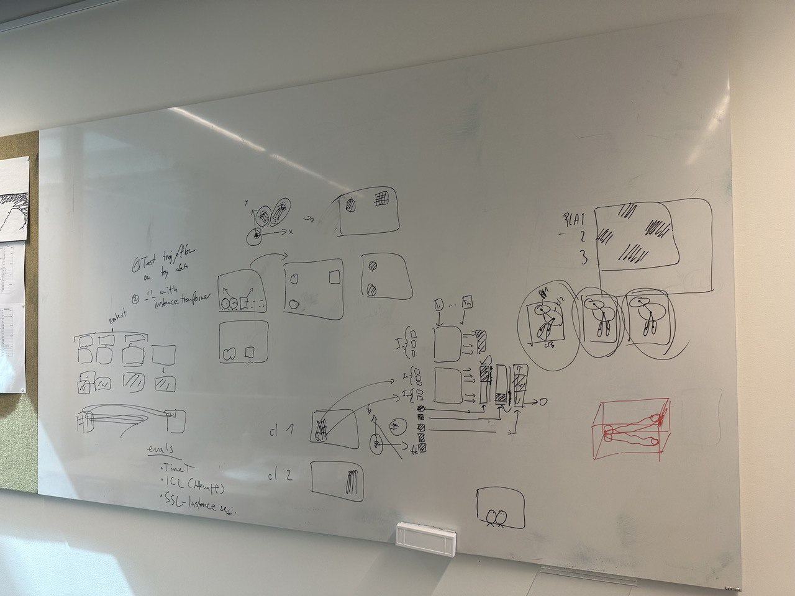
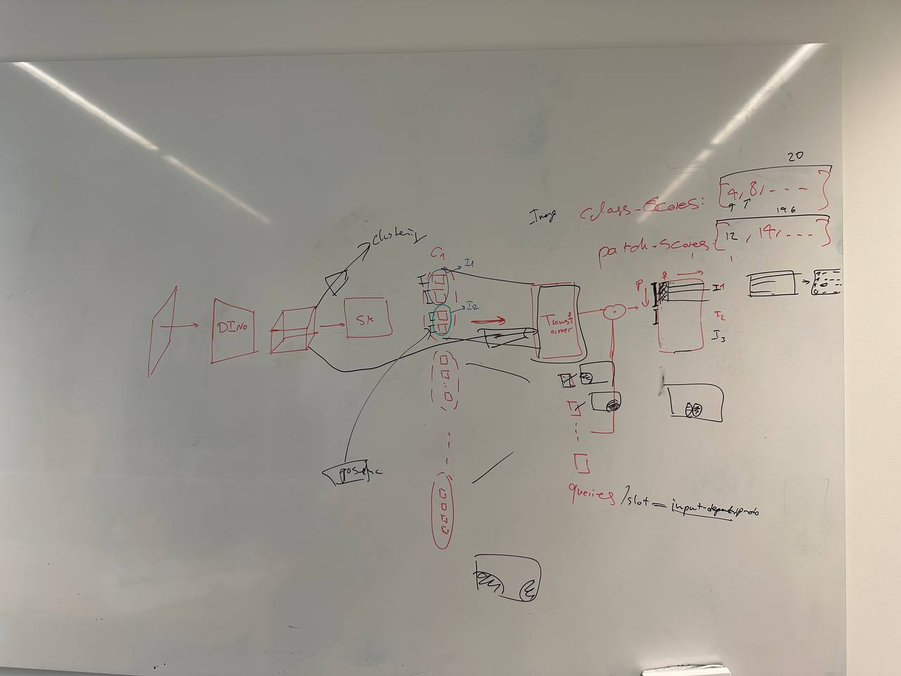

# Timetuning_v2

# 20_07_2023

According to what we have discussed so far : 

1 - Implementing hummingbird

2 - Getting the accuracy of motion trajectory prediction on a synthetic dataset

3 - What would be the performance of DINO when it is faced with overlapping objects

4 - Implementing the method with soft attention approach.

# 26_07_2023

According to what we have discussed so far : 

1 - Testing slot attention instead of prototypes

2 - Initializing the instace segmentor by training on the synthetic datasets

3 - Testing DINO + Positional + SA + GT to if it can learn instances

4 - Sliding object experiment

# Questions

1 - It is not obvious if the background is being excluded from the computation or not. I should check it out. 